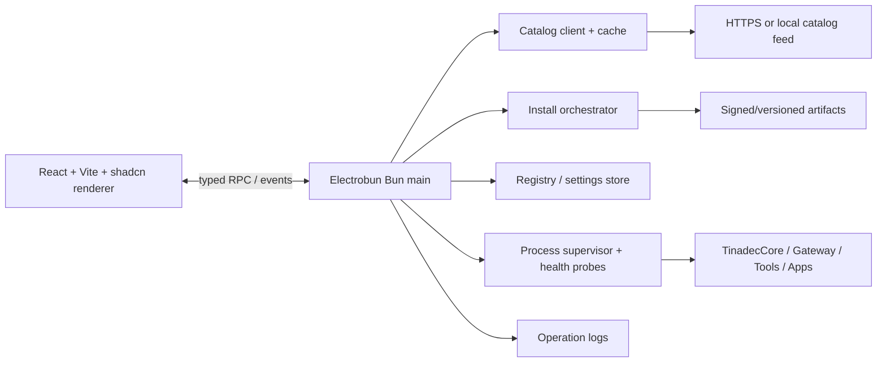

# Tinadec Manager

Tinadec 生态的桌面软件管理器（对标 Visual Studio Installer / JetBrains Toolbox 的核心闭环）：
发现可用产品、查看已安装版本、安装指定版本、更新、修复、卸载、启动与监控本地组件，
并呈现可取消、可重试、可回滚的操作进度。

## 技术栈与分层

- **Renderer**（`src/renderer`）：React 19 + Vite + Tailwind v4 + shadcn/ui + lucide 图标。
  只负责视图、交互与状态订阅，不直接访问文件系统、进程、下载或环境变量。
  在浏览器里 `bun run dev` 时自动降级为 mock RPC（fixture 数据 + 模拟操作进度），便于纯前端开发。
- **Main**（`src/main`）：Electrobun Bun 主进程，唯一受信任系统边界——目录、归档、哈希校验、
  进程树、HTTP 探测、日志与持久化全部在这里。除 `src/main/index.ts` 外均为框架无关模块，可被 Vitest 直接测试。
- **Shared**（`src/shared`）：领域模型、RPC 契约、结构化错误码、SemVer、路径安全与 manifest 校验，
  禁止 UI 与平台实现互相引用。

## 常用命令

| 命令 | 说明 |
| --- | --- |
| `bun install` | 安装依赖（锁文件 `bun.lock` 固定版本） |
| `bun run dev` | 浏览器 mock 模式开发 renderer（127.0.0.1:5173） |
| `bun run electrobun:dev` | 构建 renderer 并以 Electrobun 开发模式运行（`--watch` 跟踪主进程） |
| `bun run typecheck` | 严格 TypeScript 检查（`tsc --noEmit`） |
| `bun test` / `bun run test` | Vitest 全量单测/集成测试 |
| `bun run build` | Vite 构建 renderer 到 `dist/` |
| `bun run electrobun:build` | 构建 renderer 并用 Electrobun 打包（Windows 首发） |

## 数据与迁移

数据目录保持 `%APPDATA%/TinadecManger`（与旧 .NET 管理器相同）：

- `registry.json`：v1（`components[]`）首次加载时**幂等迁移**为 v2（`installations[]`），
  旧记录保留 id/path/executable/endpointOverride/lastKnownVersion，并标记
  `ownership: legacy-unmanaged`——仅允许探测、启动、停止与安全注销，
  不经明确确认不会删除用户目录（`docs/legacy-behavior-notes.md` 有完整行为基线）。
- `settings.json`：legacy 字段全部保留，新增目录源/渠道/并发/超时/自动更新等字段按默认值补齐。
- 所有写入均为原子（`.tmp` + rename），损坏文件自动转存 `.bak` 并回退默认。

托管安装布局（`<installRoot>/<productId>/`）：`versions/<version>/` 保存每个版本内容，
`active.json` 为原子指针；更新 = 写新 versions 目录 → 翻转指针；切换失败自动恢复旧指针（回滚），
旧版本目录保留以便重试。

## 目录 manifest v1 协议

远程目录是一个 JSON manifest（schema 见 `src/shared/domain.ts` 的 `CatalogManifest`），
校验在 `src/shared/manifest.ts`，任何非法条目（未知 schema、非法 SemVer、重复 ID、坏 URL、
坏 SHA-256、依赖区间不可解析等）整体拒绝（fail closed）。要点：

- 产品按 `family`（core/gateway/tools/app）、`delivery`、`probe` 描述；release 按 `channel`（stable/canary）发布。
- artifact 必须给出 `platform`、`architecture`、`format`（zip/tar-gz/directory/executable）、
  `url`、`sizeBytes`、`sha256`；`signature`（ed25519）字段为生产目录强制门禁预留，
  在公钥接入前 fixture 与内置目录可直接使用。
- `minimumManagerVersion` / `managerMinimumVersion` 会被主进程门禁拦截。
- 无远程 feed 时应用完整可用：内置离线目录（登记/探测/启停）+ `injectCatalogFixture` 注入 fixture 验证安装链路。

## 操作生命周期

状态固定为 `queued → downloading → verifying → staging → installing → ready`，
终态 `succeeded / cancelled / failed / rolled-back`。同一产品互斥，全局并发可配置（默认 2）；
下载支持进度、取消、重试与 HTTP Range 断点续传；校验强制大小 + SHA-256；
zip/tar.gz 解包前对每个条目做路径穿越预检；磁盘空间不足、制品被锁、校验失败都会以结构化
错误码（`src/shared/errors.ts`）写进操作记录，可在「活动记录」页取消/重试。

## 测试与验收

`bun test` 覆盖：SemVer、manifest 校验、路径安全、registry/settings 迁移、原子 JSON 存储、
操作队列（并发/互斥/取消/重试）、目录客户端（缓存/304/离线回退/fixture）、下载器（进度/取消/大小校验/哈希）、
zip 安装全流程（安装→更新→指针翻转→拒绝降级→最低管理器版本门禁）、托管删除的 legacy 保护、
三类健康探测（HTTP/进程/文件）。

DONE 条件（当前状态）：干净 checkout 可 `bun install` → 开发 → 构建 → 测试；旧 JSON 登记无损迁移；
无远程 feed 时 fixture 与本地登记可用；UI 不直接拥有系统权限；Windows 打包走 `bun run electrobun:build`。

## 路线图

生产 feed 域名、签名公钥与凭据需要在接入发布环境时提供（本仓库负责协议、客户端、fixture 与发布脚本）；
macOS/Linux 适配器接口已预留（窗口/托盘/对话框通过 main 侧适配器封装）。
